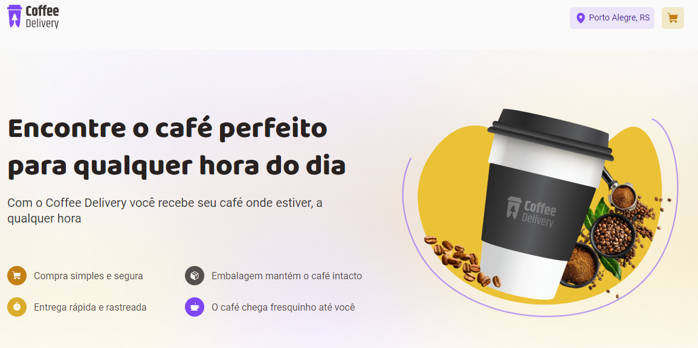
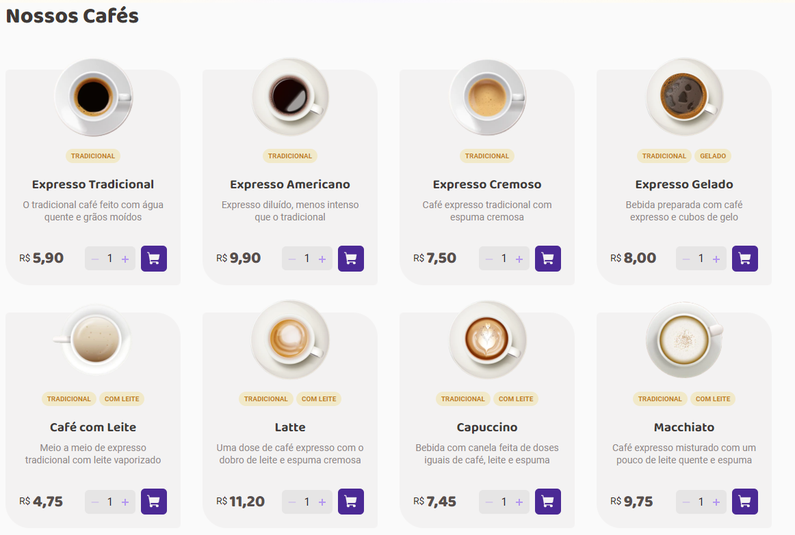
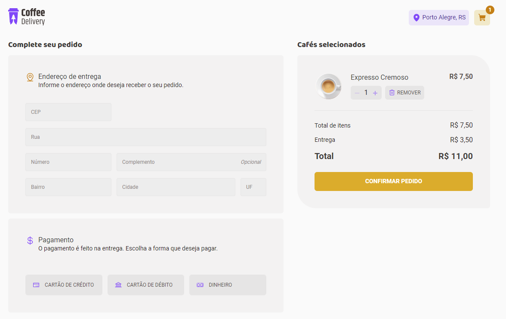
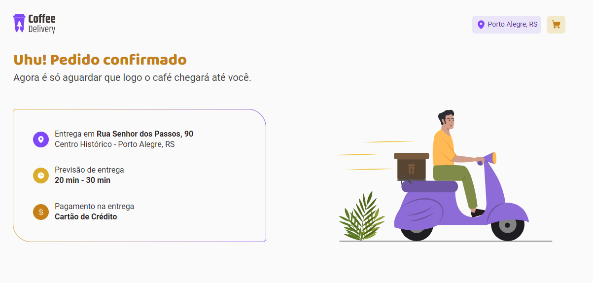

## Coffee Delivery

O projeto trata-se de um serviço de vendas de café com entrega. No desafio não foi solicitado responsividade, nem disponibilizado layout mobile caso quisesse implementar.

### 🛠️ Nesse projeto foi utilizado

- Vite
- Styled Components
- Typescript
- Local Storage
- Context API (CartContext)
- Hooks (useState, useEffect)
- Custom Hooks (useCart)
- React Hook Form
- Zod (Para validação do formulário)
- Immer (Para alteração de estado)

 

  

  

 

  

  

  

  

